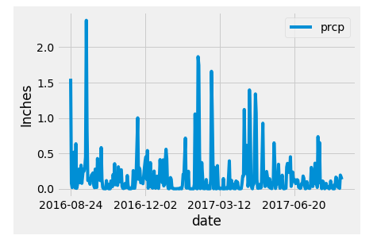
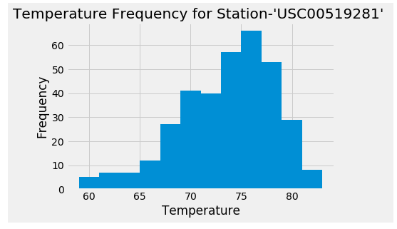
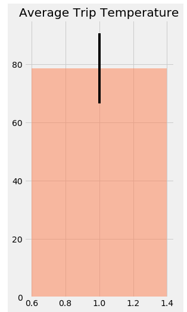
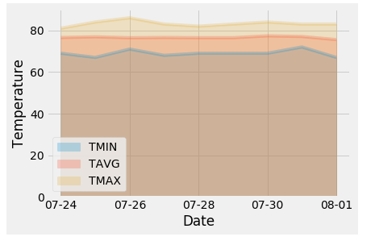

# Hawaii-Weather-Analysis-withSQLAlchemy
It is important to know the weather of a particular place before planning a vacation. This project helps in planning a vacation using the patterns of temperature and percipitation data for previous years for 9 stations in Hawaii.

## Tools and Technologies used and required to run the file
* Python 3
    * Libraries:- Pandas, Matplotlib, SQL Alchemy, Flask, NumPy, Datetime
* Jupyter Notebook

## How to run the code
1. Download climate.ipynb, app.py and Resources folder
2. Open Jupyter Notebook and open climate.ipynb and run all cells
3. In your terminal, close the jupyter notebook and run the command "python app.py"
4. In your browser, go to the address "localhost:5000"
5. Checkout available routes on the home page and visit any route for required additional information. To get data on particular dates:-
    * Go to "localhost:5000/api/v1.0/start-date/end-date" and instead of start-date and end-date enter the dates you want to look for in "yyyy-mm-dd" format.

## Output 
*  Last 12 months of precipitation data

* Usual Temperature at a particular station in Hawaii.

* In the 18th cell, particular dates have been selected for the trip, same can be changed to look for your trip duration.  

* Minimum, Maximum and Average Temperatures on each day of the trip

